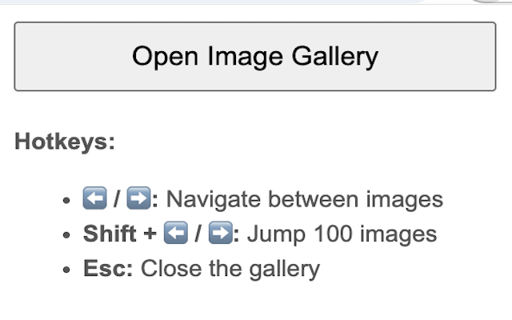

# Image Gallery Viewer Chrome Extension

## Description

Image Gallery Viewer is a Chrome extension that helps you
effortlessly browse and manage image galleries directly within your browser. 
With hotkey support, you can quickly navigate through images in any folder, 
making it ideal for photographers, designers, and anyone working with visual assets.

🎹 Hotkey Support:
 - ⬅️ / ➡️: Navigate between images.
 - Shift + S: Jump 100 images forward. 
 - Esc: Close the gallery.